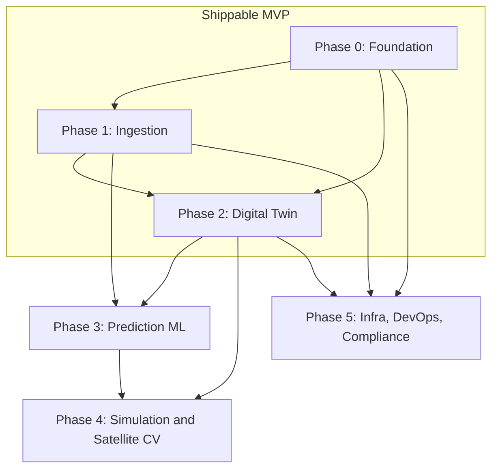

# Property Digital Twin — Build Prompt Playbook

Copy-paste-ready coding-agent prompts that build the **Property Digital Twin — Future Intelligence Platform** end-to-end, phase by phase.

> Scope: Noida · Greater Noida · Yamuna Expressway · Jewar Airport corridor.
> This playbook is the executable companion to [`../property-digital-twin-engineering-blueprint.md`](../property-digital-twin-engineering-blueprint.md). Read the blueprint once for the "why"; use these files for the "how".

---

## How to use this playbook

1. Work **top to bottom**. Each prompt has a `Depends on` field — never run a prompt before its dependencies are green.
2. Open the phase file, copy **one prompt block** (everything under a `### Pn.m` heading), paste it into the coding agent, and let it finish.
3. Verify the prompt's **Acceptance criteria** before moving on. If a criterion fails, re-prompt with the failure rather than proceeding.
4. Commit after every completed prompt. Prompt IDs (`P1.4`, `P2.10`, …) make good commit-message prefixes.
5. Do **not** batch multiple prompts into one agent run — each is sized to be one reviewable unit of work.

Each prompt uses this fixed template:

- **Context** — what already exists / where this fits.
- **Task** — exactly what to build.
- **Tech constraints** — stack, libraries, and blueprint patterns to honor.
- **Deliverables** — the files/dirs the agent must produce.
- **Acceptance criteria** — verifiable done-conditions.
- **Depends on** — prior prompt IDs that must be complete first.

---

## Non-negotiable principles (baked into every prompt)

These come straight from Section 0 of the blueprint. Every prompt is written to respect them; do not let an agent "optimize" them away.

1. **The moat is the data, not the model.** Freshness + coverage of the ingestion layer is the product. Build Phase 1 properly before rushing to AI.
2. **Facts, not verdicts.** Never compute a proprietary "builder trust judgment." Surface official UP-RERA records verbatim, always cited. This is the line between *aggregator* and *defamer*.
3. **Predictions are advisory-adjacent.** Every number ships with a confidence band (never a bare point number) and a visible "estimate, not investment advice" disclaimer.
4. **High-stakes facts go through a human-verification queue.** Anything binary and consequential (e.g. "metro approved: yes/no") or any extraction below the confidence threshold must be human-verified before users see it.
5. **The LLM explains; it never invents numbers.** Price/traffic/flood/water/AQI values come from deterministic + ML models. The LLM only structures documents, explains predictions, and answers grounded (retrieved + cited) questions.

---

## Target tech stack

| Layer | Choice | Rationale (blueprint) |
|---|---|---|
| Backend / ingestion / ML | Python 3.11+, Poetry, FastAPI | one language across data + ML + API |
| Orchestration | Dagster | easier to reason about for a small team (§3.2) |
| Primary DB | Postgres 16 + PostGIS + pgvector | geospatial + ACID + vectors in one store (§4, §9) |
| Migrations | Alembic | versioned schema |
| Object storage (raw cache) | S3 / GCS / Cloudflare R2 (via `boto3`/S3-compatible client) | raw tier of the cache (§3.3) |
| Frontend | Next.js (React) + TypeScript | geospatial ecosystem (§8) |
| Map | Deck.gl + Mapbox GL JS | large geospatial overlays at scale (§8) |
| LLM/RAG | vendor-agnostic client + pgvector retrieval | check vendor pricing at build time (§6) |
| ML (Phase 3) | XGBoost / LightGBM (tabular), scikit-learn | no LLM for numbers (§5) |
| CV (Phase 4) | PyTorch segmentation on GPU spot batch | change detection (§3.5) |
| Deploy | AWS or GCP + IaC (Terraform) | pick by team familiarity (§9) |

---

## Monorepo layout (created in Phase 0, extended thereafter)

```
RealEstate/
├── prompts/                     # this playbook
├── property-digital-twin-engineering-blueprint.md
├── docker-compose.yml           # Postgres+PostGIS+pgvector, object-storage emulator
├── Makefile                     # bootstrap / lint / test / migrate / seed
├── pyproject.toml               # Poetry workspace root
├── packages/
│   ├── common/                  # shared Python lib: config, logging, db, storage, http
│   ├── ingestion/               # crawler fleet + Dagster DAGs + cache/verify + doc-intel
│   ├── warehouse/               # knowledge-graph repo layer + migrations (Alembic)
│   ├── api/                     # FastAPI app: facts, score, builder, proximity, copilot, predictions
│   ├── ml/                      # Phase 3 models, feature store, training, serving
│   ├── cv/                      # Phase 4 satellite change-detection
│   └── simulation/              # Phase 4 what-if engine
├── apps/
│   └── web/                     # Next.js frontend (map, timeline, score card, copilot chat)
├── infra/                       # Terraform / IaC (Phase 5)
└── .github/workflows/           # CI
```

---

## Phase map

| Phase | File | Blueprint sections | Deliverable |
|---|---|---|---|
| 0 | [`phase-0-foundation.md`](phase-0-foundation.md) | §2, §4, §9 | Monorepo, DB + base schema, shared libs, CI |
| 1 | [`phase-1-ingestion.md`](phase-1-ingestion.md) | §3 | Source registry, cache/verify, crawler fleet, doc intelligence, review queue, observability |
| 2 | [`phase-2-digital-twin.md`](phase-2-digital-twin.md) | §4, §6 (MVP), §8 | The 5 v1 features: timeline, score, proximity, RERA card, copilot — facts only |
| 3 | [`phase-3-prediction-ml.md`](phase-3-prediction-ml.md) | §5, §6 | Price/traffic/flood/water/AQI models + full RAG copilot |
| 4 | [`phase-4-simulation-satellite.md`](phase-4-simulation-satellite.md) | §7, §3.5 | What-if simulation + satellite change-detection CV |
| 5 | [`phase-5-infra-devops-compliance.md`](phase-5-infra-devops-compliance.md) | §9, §0, §13 | Deploy, observability, cost controls, legal/compliance |

The blueprint's realistic timeline (small team, 2–4 people) is **~9–13 months** to a complete v1 with real ML. Phases 0–2 are the shippable MVP; Phases 3–4 need accumulated live data from Phases 1–2 before they are trustworthy.

---

## Build dependency graph



Key rule: **Phase 3 (ML) must not start until Phases 1–2 have been running live long enough to accumulate real data.** Shipping ML on thin data produces wrong answers and permanently kills user trust (blueprint §1, §5).

---

## Quickstart: the blueprint's "Next 2 Weeks" mapped to prompts

The blueprint's Section 11 concrete two-week plan corresponds to this exact prompt sequence:

1. Pick 3 sources (YEIDA, DMRC/NMRC, UP-RERA) → **P1.4, P1.5, P1.6**
2. Postgres + PostGIS, define `InfraEvent` + `Builder` tables → **P0.2**
3. Build the cache/verify layer as a shared library first → **P1.2**
4. Hand-extract 20 real infra events as a labeled test set → **P1.8** (labeled-set task)
5. Ship a static locality timeline for one sector → **P2.9** (hand-entered-data mode)

Do P0.1 → P0.4 first (a few days of scaffolding), then this sequence gives you a demoable proof-of-concept before any automation hardens.
